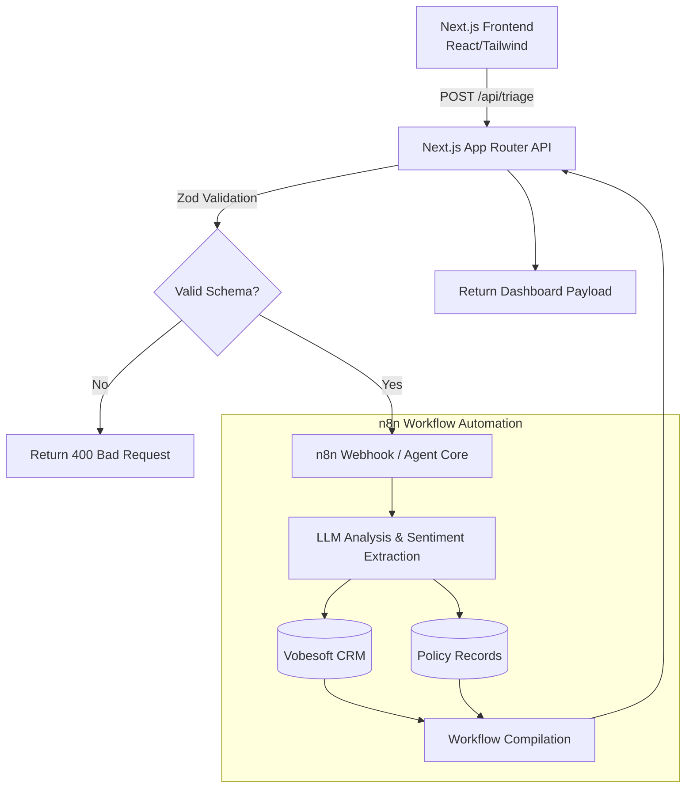

# Malastor Insurance - Claim Execution Center

Malastor Insurance's cutting-edge AI Triage Portal. This application serves as a demonstration of an automated claim ingestion, processing, and executing workflow driven by Next.js in the frontend, an API bridging layer, and simulated `n8n` orchestrated AI tasks on the backend.

## Architecture

This project strictly adheres to robust B2B engineering practices, emphasizing real-time feedback, detailed validation, and a multi-layered security and data flow model.

## Highlights & Features

- **Strict TypeScript Typing:** Ensures robust props, component hierarchies, and payload safety.
- **Zod Schema Validation:** API endpoints rigorously parse input schema formats (e.g., regex checks on `POL-XXXXXXX`).
- **Glassmorphic Exec Center UI:** Built with dark-mode optimized Tailwind utility classes and Framer Motion layout transitions.
- **Agent Intelligence Pipeline:** Visualized AI reasoning processes simulating real-world asynchronous extraction and CRM updating.
- **Error Boundaries:** Endpoints implement `try/catch` and resilient response wrapping to avoid client crashes.

## Running Locally

1. `npm install`
2. `npm run dev`
3. Enjoy the Malastor Triage Experience.
